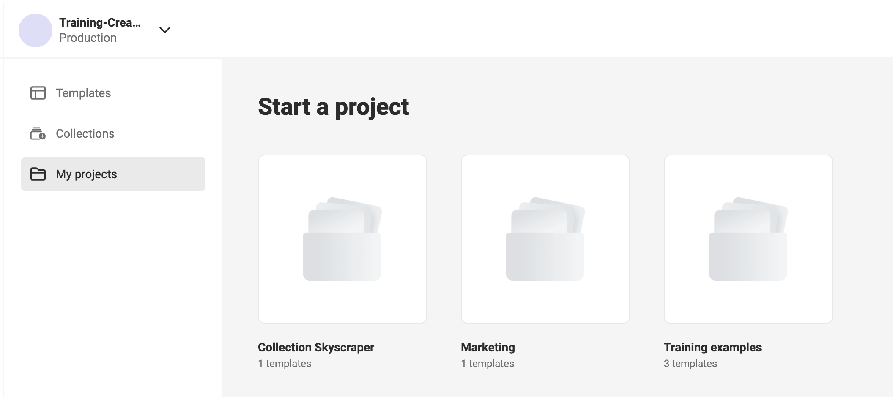
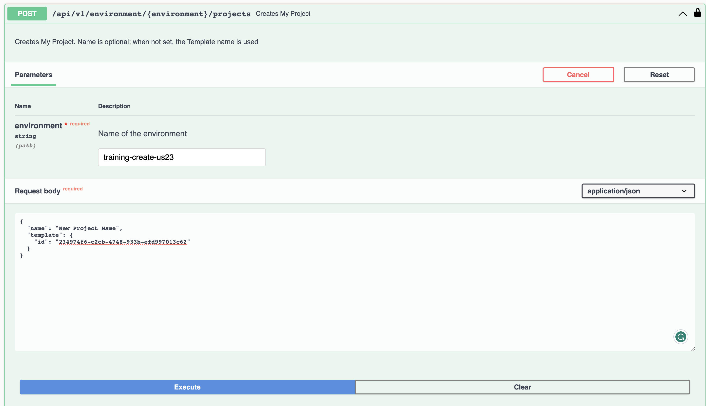
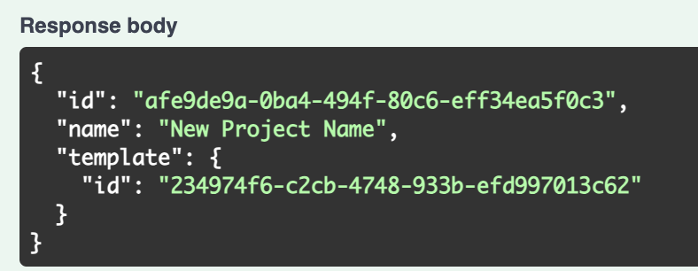

# Studio UI (End User View)

!!! Warning
    Please note that the documentation (and related code bundle) is subject to change for this. These changes should
    be easy to implement within your integration but because this end user view is not officially available yet and still
    undergoing the final touches.

    These are currently the planned changes, but subject to change:

    - We currently plan to open source the end user view (and components) as "Studio UI" we are still working on documentation and licensing.
    - The cdn suffix of `end-user-workspace` will change to `studio-ui` together with open sourcing the application and documenting the integration steps. This page is to serve as an example for more confident programmers looking to jump start their integration.
    - This example uses the latest studio-ui (end-user workspace) version, which will be synced to the latest sdk version used in studio-workspace (template designer workspace), it'll be possible to pin it to the sdk version you use in the integration but you will not receive any updates.

## Setting up the end user view
At the bottom of this page you will find the code for a single HTML file that can serve as an example on how to integrate the end user view in to your website.

The Studio UI (end user view) will work similar to the GraFx Studio template designer workspace, you simply provide it with
the id of a `<div>` element within your application and it will construct the end user editor at the div.

If you need help generating a token or would like code samples, please see our [Integration Guide](/CHILI-GraFx/guides/integrations/)


#### IMPORTANT DETAIL
Projects are context based, if you look at the projects on the GraFx platform you are quite literally looking at _YOUR USER_ projects. That mean that another context doesn't have access to the projects. This means that the integration context doesn't have access to the projects you create on your account in GraFx Platform.


The project IDs in this UI screenshot are **not** available to your integration because they are assigned to the user that created them in GraFx Platform.

You will need to create projects via the API or [your environments swagger](/GraFx-Developers/). You can do this by getting the template ID of a template you want to make editable to an end user.

The easiest way to create a project ID that you can load in your end user integration.


Then you can get the ID of the newly created project in the response and use it in the Studio UI example code below
.

**You will need to host the demo file on a web server for the editor to load**


### The Code
```html
<!DOCTYPE html>
<html lang="en">
<head>
  <meta charset="UTF-8">
  <meta name="viewport" content="width=device-width, initial-scale=1.0">
  <title>Studio UI Example</title>

  <link rel="stylesheet" href="https://studio-cdn.chiligrafx.com/end-user-workspace/latest/main.css" />
</head>
<body>
  <div id="end-user"></div>

  <script src="https://studio-cdn.chiligrafx.com/end-user-workspace/latest/bundle.js"></script>
  <script>

    const token = `<YOUR INTEGRATION TOKEN>`;
    /* The HTML div for the editor */
    const endUserDiv = "end-user";
    const environmentBaseURL = "https://training-create-us23.chili-publish.online/grafx/api/v1/environment/training-create-us23"

    /* ID of the project you want to load in the end user view*/
    const projectID = "859dd405-bfed-467f-b833-510afef5fda4"
    const projectName = "End User view"

    const refreshTokenAction = () => Promise.resolve("Nothing");
    const onBack = () => console.log("You pressed the back button!");

    window.StudioUI.studioLoaderConfig(
      // Div id to inject studio-ui in
      endUserDiv,
      // downloadUrl
      `${environmentBaseURL}/projects/${projectID}/document`,
      // uploadUrl
      `${environmentBaseURL}/projects/${projectID}`,
      // project Id
      projectID,
      /* environment base URL ex: https://cp-abc-123.chili-publish.online/grafx/api/v1/cp-abc-123 */
      environmentBaseURL,
      /* Integration access token */
      token,
      /* refreshTokenAction, being a function that will return a promise () => Promise<string | Error>; */
      refreshTokenAction,
      /* projectName: string, name of the project. Shown in the UI (does not have to be match the real name) */
      projectName,
      /* onBack function that will handle what the back arrow in the studio ui does */
      onBack
    );
  </script>
</body>
</html>
```