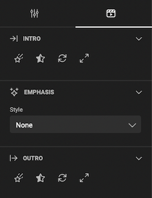

# Item Animation

For the 3 stages of animation, you can set animation properties.

## Intro section

- Easing type (the star)
- Fade (star half filled)
- Rotation (two half circle arrows)
- Scale (2 diagonal arrows)

### Easing type

The ease type defines wether the animation should start fast, ends fast or both.

The Twee type defines [the type of animation](https://easings.net/){target="_blank"}.

Sliding from: defines where the animation starts.

Slide Offset: defines how far off, the animation will start. A setting of 0% means it will "appear", and the animation will have no effect visually.

### Fade

Setting the fade, will visually fade in the object.

### Rotation

Set the starting point of the rotation.

When you set to e.g. -90°, the object will start from -90° from its definitive position.

The number of rotations: sets the number of rotations the object will make before ending up in its final position.

### Scale from

Set the size (in percentage) where the object starts, to grow towards 100%.

## Emphasis section

### Style

Choose a style from the list, and test out the effect.

### Ease & Tween type

The ease type defines whether the animation should start fast, ends fast or both.

The Tween type defines [the type of animation](https://easings.net/){target="_blank"}.

## Outro section

This is similar to the intro, but has impact on the end of the animation.

E.g. scale and rotate will be **to** vs **from** in the intro.