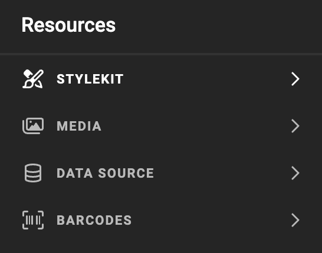
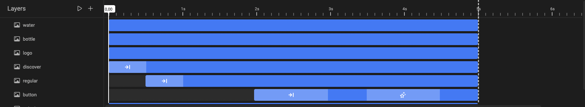

# Quick Tools (bottom)

Set of tools at the bottom of the sidebar.

- Layouts
- Layers & Animation
- Resources
    - Brand Kit Panel
    - Media
    - Data Source
    - Barcodes

{.screenshotsmall}

{.screenshot}

E.g. When selecting the **Layers and Animation** tool, an extra properties panel will open.

