# Brand Kits

{.screenshotsmall}

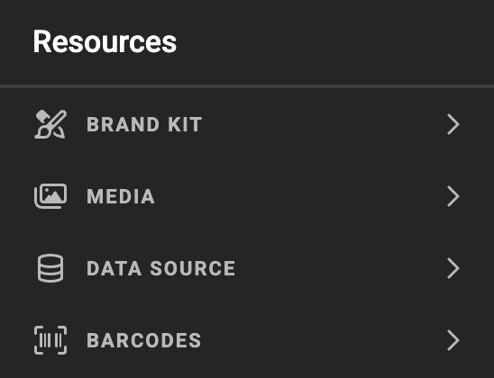{.screenshot}

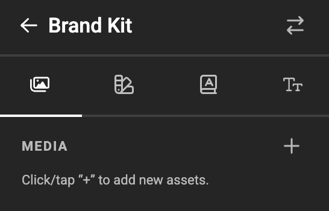{.screenshot}

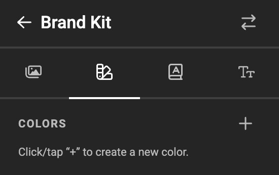{.screenshot}

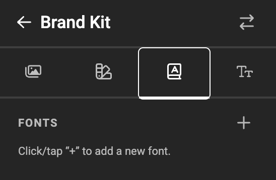{.screenshot}

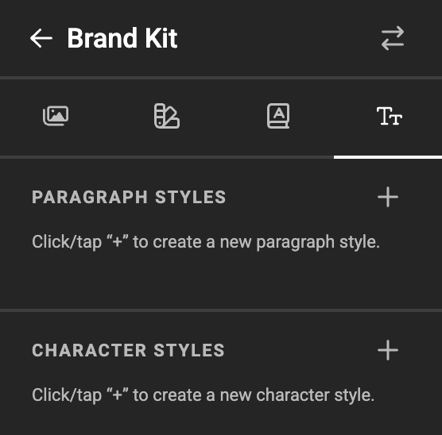{.screenshot}

## Media

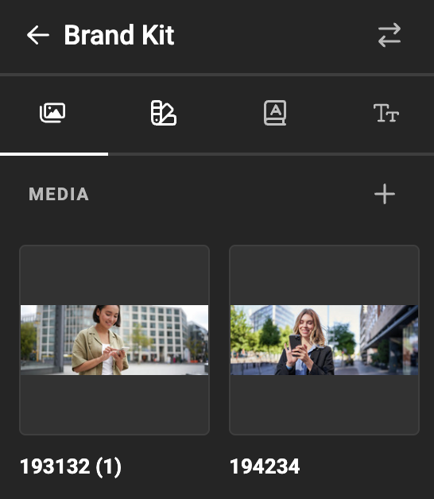{.screenshot}

Add media to your Brand Kit

## Text: Paragraph Styles

{.screenshot}

The pencil button allows editing the properties.

The fill color can be a custom color, or a predefined [color](/GraFx-Studio/concepts/brandkits/#color).

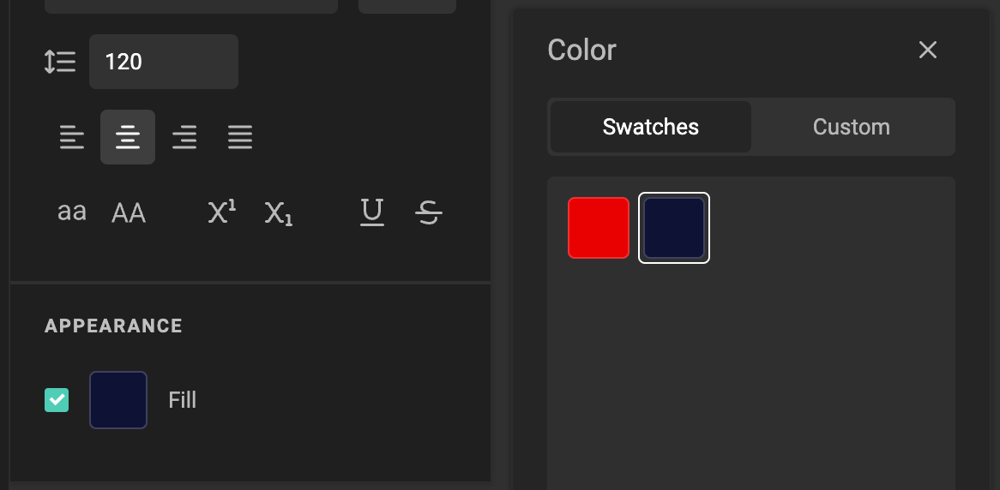{.screenshot}

## Text: Character Styles

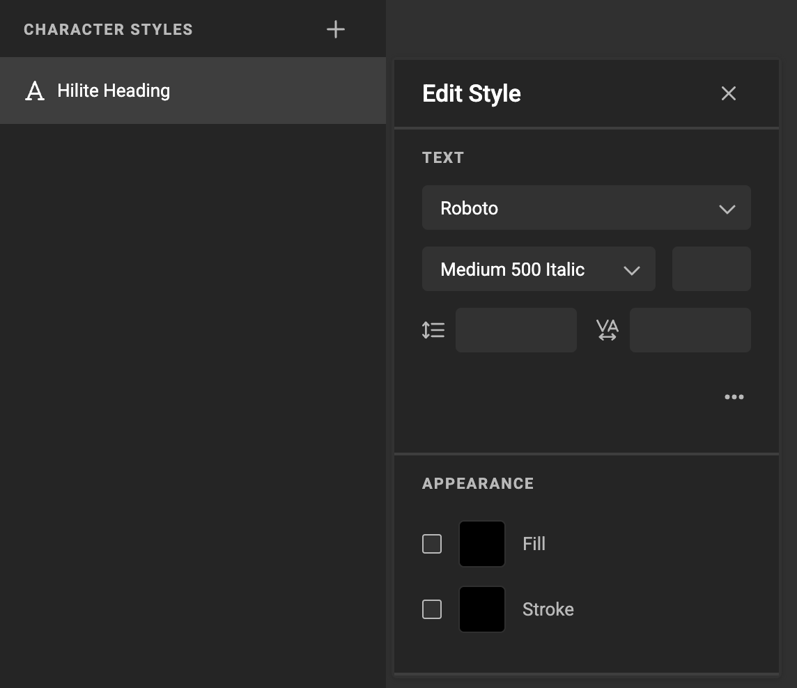{.screenshot}

## Color

A "color" is a predefined color saved inside a Brand Kit. You can reuse the color in paragraph- en character styles.

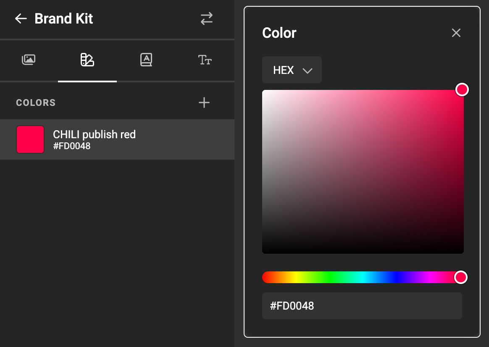{.screenshot}

Define a color, give it a name and save the named color to be used later.

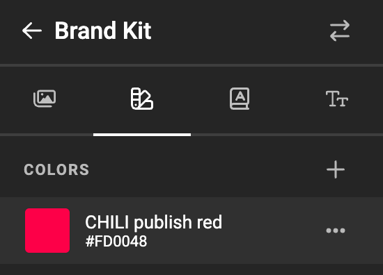{.screenshot}

## Fonts

Select the font-book to view your fonts, and add them to the kit.

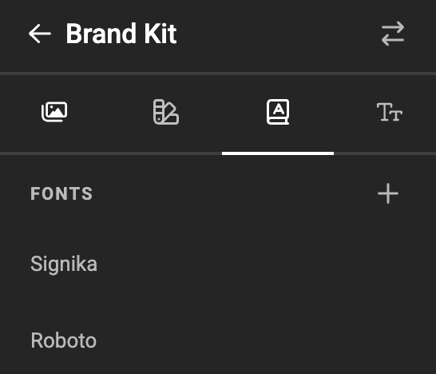{.screenshot}

Select the font family you want to add to your document.

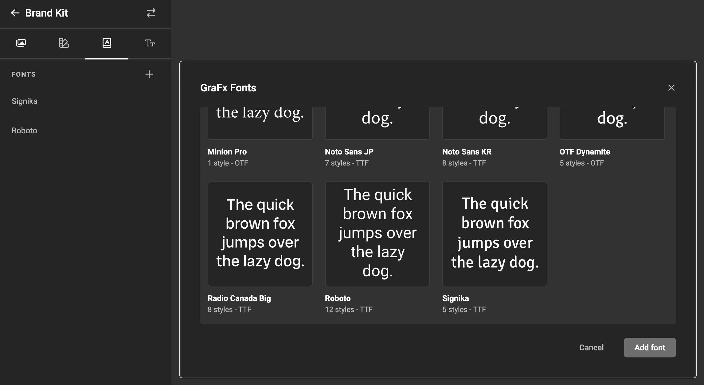{.screenshot}

[See GraFx Fonts](/GraFx-Fonts/)