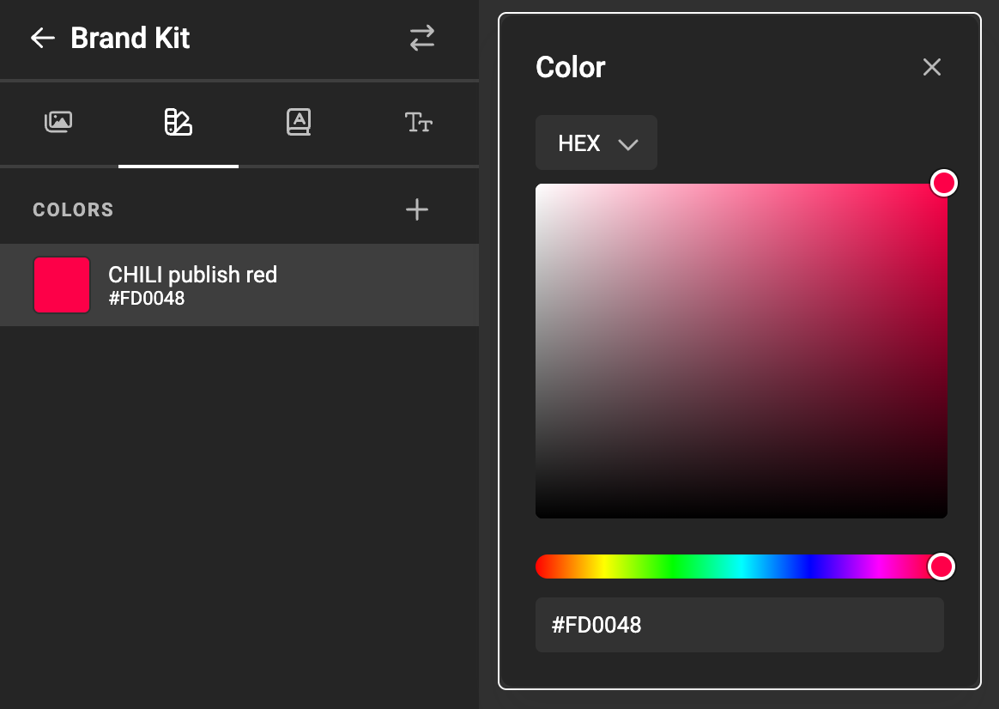

# Brand Kits

## Media

Add media to your Brand Kit

## Text: Paragraph Styles

The pencil button allows editting the properties.

The fill color can be a custom color, or a predefined [swatch](/GraFx-Studio/concepts/brandkits/#swatch).

## Text: Character Styles

## Swatch

A swatch is a color saved inside a Brand Kit. You can reuse the swatch (predefined color) in paragraph- en character styles.

Define a color, give it a name and save the named color to be used later.

## Fonts

Select the font-book to view your fonts, and add them to the kit.

Select the font family you want to add to your document.

[See GraFx Fonts](/GraFx-Fonts/)