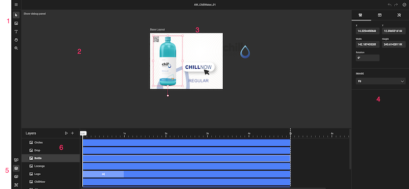

# Document or Page

Your document or page of the document.

For a single page document, we refer to the "document". For a multi page document, this would be the page. (3)

When opening the canvas, the document is zoomed to fit. 

When switching layouts, the document zooms to fit.