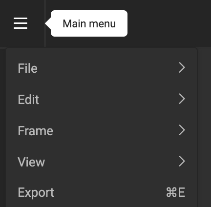
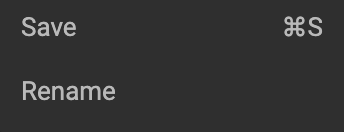
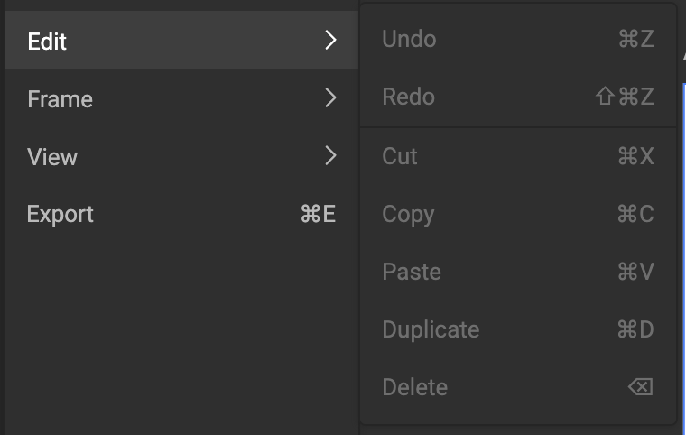
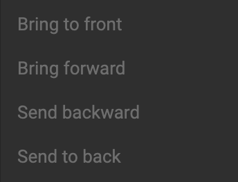
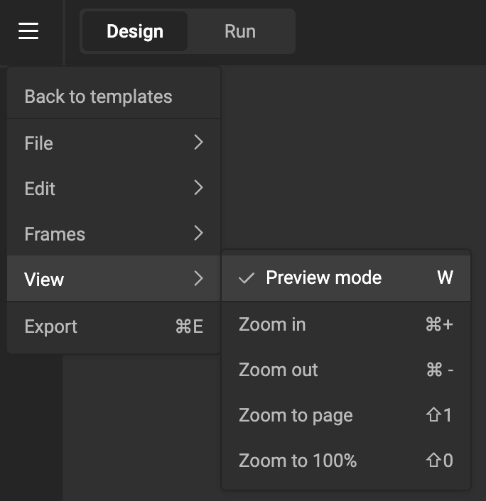
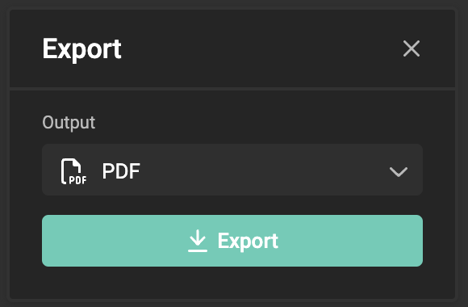

# The Hamburger Menu

This is the main menu, with quick access to functions you need for your Smart Template.

{.screenshot}

## File

Save and rename your Smart Template.

{.screenshot}

## Edit

All the usual undo, redo, cut, copy, paste, duplicate, and delete functions.

{.screenshot}

## Frame

Move the frame up or down. (See [Z-index](/GraFx-Studio/concepts/frames/#z-index))

{.screenshot}

Available when a frame is selected, and if relevant.

E.g. When only 1 frame is available, "Bring to front/back" will be grayed out.  
When multiple frames are available, but the frame is the frontmost, "Bring to font" will be grayed out.

## View

Toggle View mode (enables or disables frame borders and the bleed box).

Zoom the canvas in or out.

{.screenshot}

## Export

Shows the export dialog, with all [output settings](/GraFx-Studio/concepts/output-settings/) you have defined.

{.screenshot}