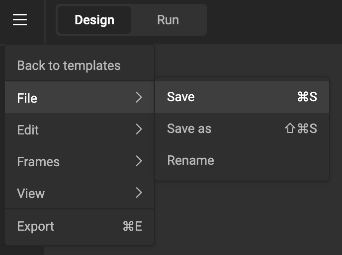
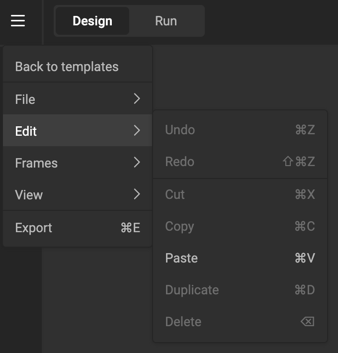

# The Hamburger Menu

## File

Save or rename your file.

## Edit

All the usual undo, redo, cut, copy, paste, duplicate, and delete functions.

## Frame

Move the frame up or down. (See [Z-index](/GraFx-Studio/concepts/frames/#z-index))

## View

Toggle View mode (enables or disables frame borders and the bleed box).

Zoom the canvas in or out.

## Export

Shows the export dialog, with all [output settings](/GraFx-Studio/concepts/output-settings/) you have defined.

