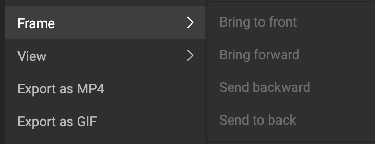

# The Hamburger Menu

This is the main menu, with quick access to functions you need for your Smart Template.

#### File

Save and rename your Smart Template

#### Edit

#### Frame

Available when a frame is selected, and if relevant.

E.g. When only 1 frame is available, "Brint to front/back" will be grayed out.  
When multiple frames are available, but the frame is the frontmost, "Bring to font" will be grayed out.

#### View

Preview mode toggles viewmode on and off.

Zoom allows to get a closer look at you Smart Template to tweak the tiniest detail.

#### Export

In combination with **Output Settings** the Export menu will show a dialog providing all the defined Output Settings.

