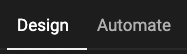

# Header bar

Depending on your need, you can choose a different overall toolset to

- Design
- Automate

## Design

The UI changes to allow you to focus on the tools to Design or Create your smart template

## Automate

The UI changes to focus on automation tasks.

E.g. when choosing "Automate" the panel to create variables will appear.