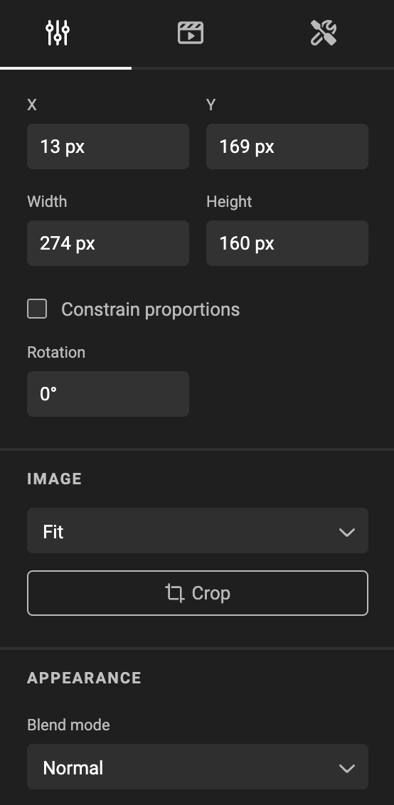
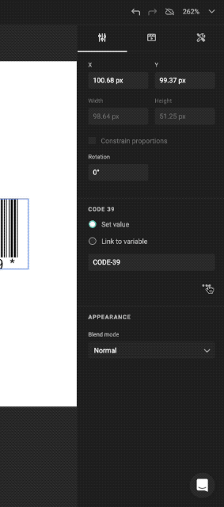
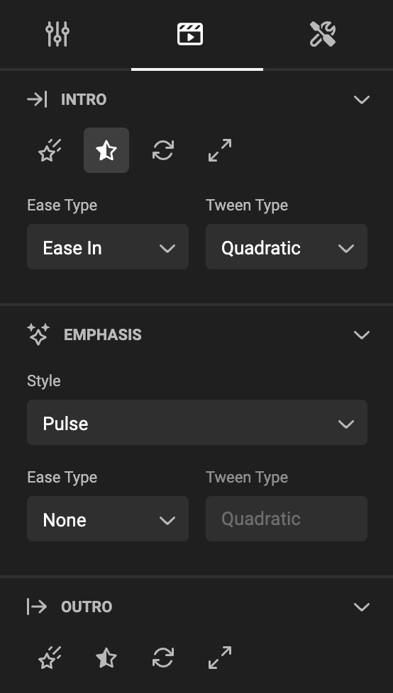
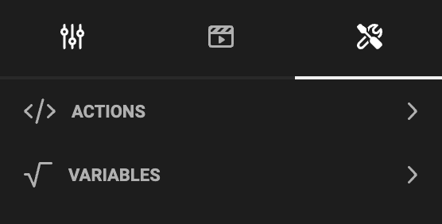

# Properties

The properties panel appears with the selection of an item. The context of the selected item dictates the content of the properties panel.

## The basic properties

Set the width, height, position and rotation of a frame.

If you selected an image frame, you can also choose the fit and crop of the image in the frame.

## Extended properties

In some cases (e.g. Barcodes), extra properties can be found behind the "..." (three dots) menu.

## Animation properties

By default, a frame is not animated. With these setting, you can set the behaviour of the intro, emphasis and outro of the animation.

## Automation properties

### Variables

By default, a frame does not have variables. You can set, unset and change the setting for a variable set to (in) the frame.

### Actions

A new document starts without [Actions](/GraFx-Studio/concepts/actions/).