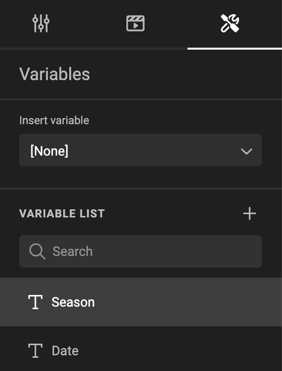

# Properties

The properties panel appears with the selection of an item. The context of the selected item dictates the content of the properties panel.

## The basic properties

Set the width, heigt, position and rotation of a frame.

If you selected an image frame, you can also choose the fit of the image in the frame.

## Animation properties

By default, a frame is not animated. With these setting, you can set the behaviour of the intro, emphasis and outro of the animation.

## Variable properties

By default, a frame does not have variables. You can set, unset and change the setting for a variable set to (in) the frame.

