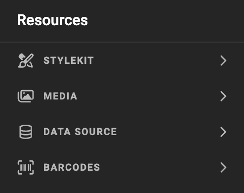
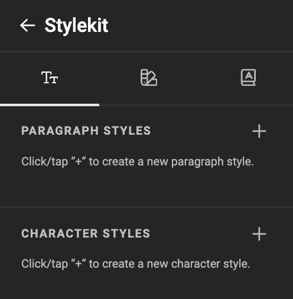

# Stylekit

## Text: Paragraph Styles

The pencil button allows editting the properties.

The fill color can be a custom color, or a predefined [swatch](../../../GraFx-Studio/concepts/stylekits/#swatch).

## Text: Character Styles

## Swatch

A swatch is a color saved inside a Stylekit. You can reuse the swatch (predefined color) in paragraph- en character styles.

Define a color, give it a name and save the named color to be used later in a style.

## Fonts

### Adding Fonts

Select the font-book to view your fonts, and add them to the stylekit.

Select the font family you want to add to your document.

[See GraFx Fonts](../../../GraFx-Fonts/)