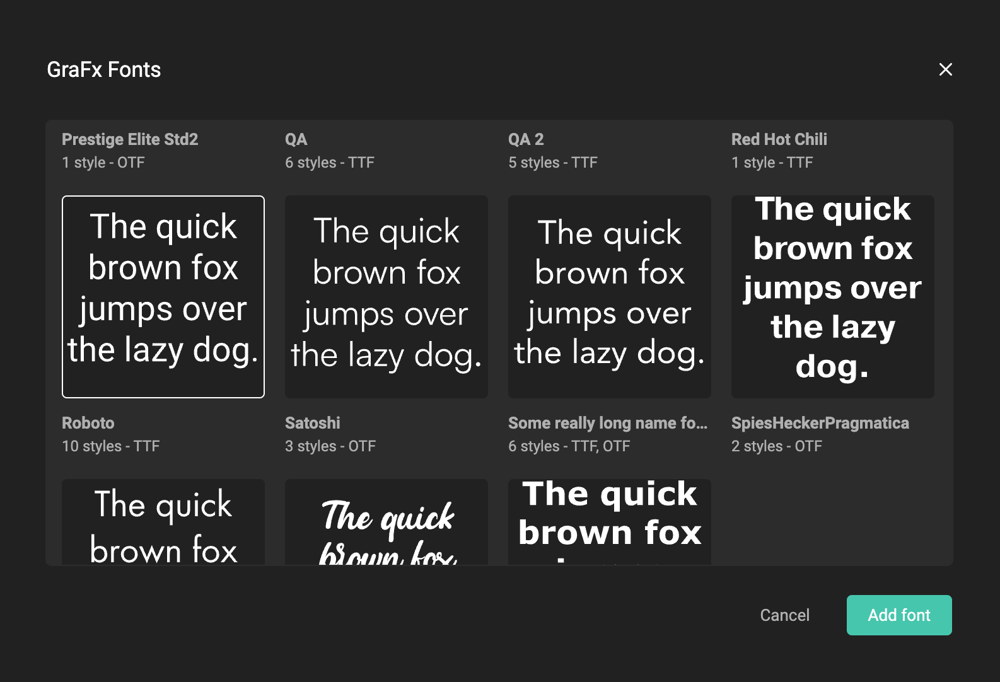

# Stylekit

## Text: Paragraph Styles

The pencil button allows editting the properties.

The fill color can be a custom color, or a predefined [swatch](/GraFx-Studio/concepts/stylekits/#swatch).

## Text: Character Styles

## Swatch

A swatch is a color saved inside a Stylekit. You can reuse the swatch (predefined color) in paragraph- en character styles.

Define a color, give it a name and save the named color to be used later in a style.

## Fonts

### Adding Fonts

Select the font-book to view your fonts, and add them to the stylekit.

As of writing, Fonts are managed through the BackOffice of GraFx Publisher.
Add them to a folder in the BackOffice, and they will appear in the selection window.

[See GraFx Fonts](/GraFx-Fonts/)