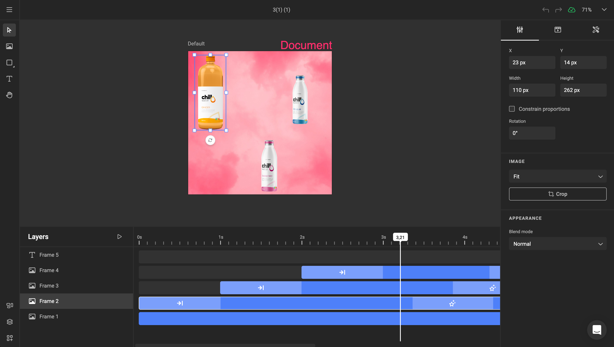
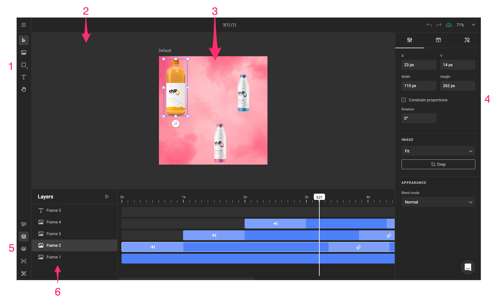
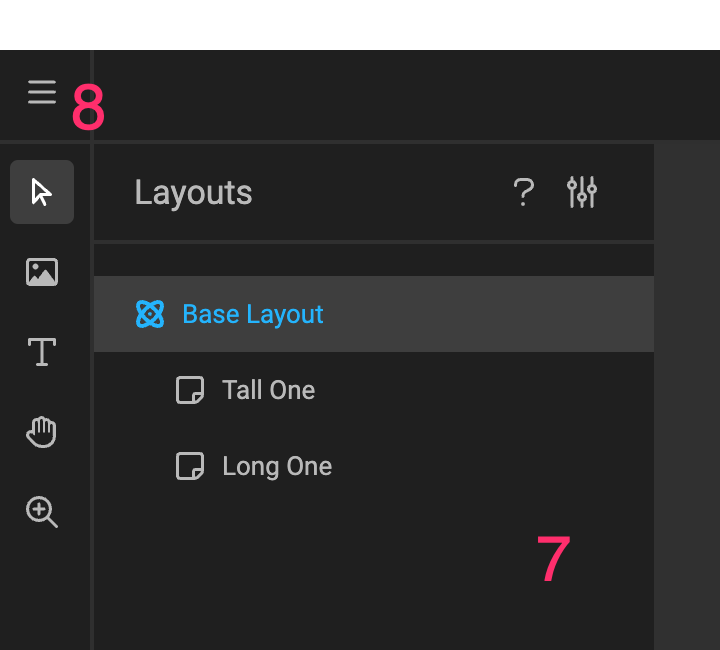
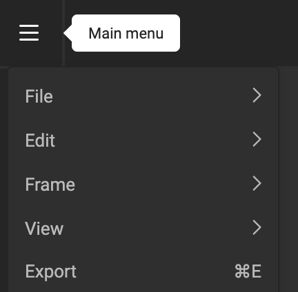
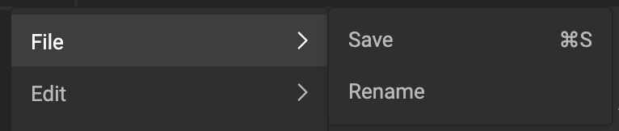
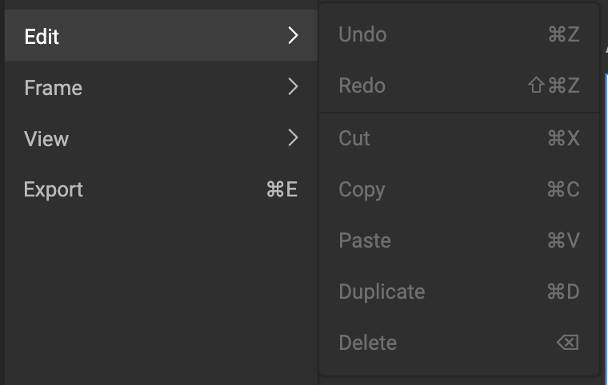
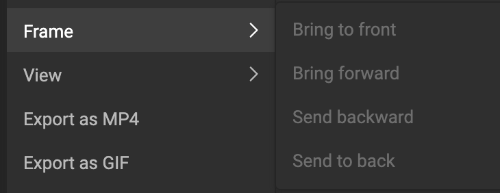
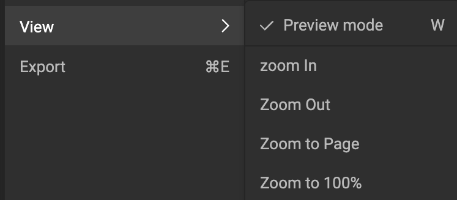

# Workspace elements

When opening the GraFx Studio editor, you will see the full workspace

## Elements on screen

### 1 Sidebar

Toolpanel to select the tool you wish to use to edit your document.

### 2 Document Canvas

The document Canvas.

### 3 Page or Document

Your smart template, showed as a page or the full document.

### 4 Properties

A panel where content will show the properties of the selected item in your document.

### 5 Bottom Quick Tools

Additional tools to display panels for specific use

- Alternate Layouts
- Layers & Animation
- Media
- Styles

### 6 Bottom panel

Contextual bottom panel will hold information for relevant tools.

E.g. the Layers/Animation timeline will be displayed here

### 7 Quick Tools Details

Depending on the selection of your tool you'll see different details.

E.g. with alternate layouts, you can organize your layouts.

### 8 Hamburger menu

This is the main menu, with quick access to functions you need for your Smart Template.

#### File

Save and rename your Smart Template

#### Edit

#### Frame

Available when a frame is selected, and if relevant.

E.g. When only 1 frame is available, "Brint to front/back" will be grayed out.  
When multiple frames are available, but the frame is the frontmost, "Bring to font" will be grayed out.

#### View

Preview mode toggles viewmode on and off.

Zoom allows to get a closer look at you Smart Template to tweak the tiniest detail.

#### Export

In combination with **Output Settings** the Export menu will show a dialog providing all the defined Output Settings.

