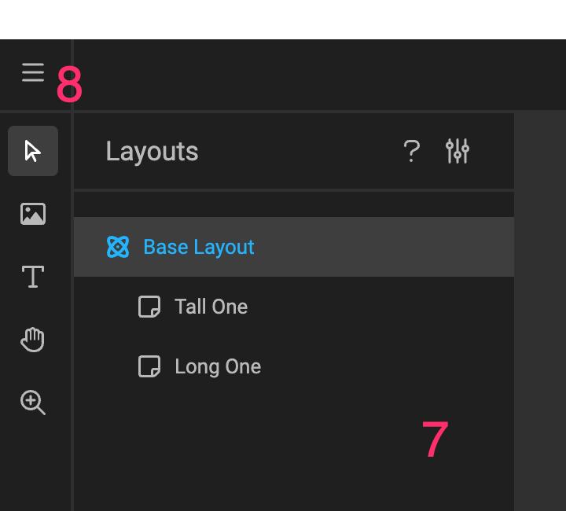

# Workspace elements

When opening the GraFx Studio editor, you will see the full workspace

## Elements on screen

{.screenshot-full}

### 1 Sidebar

Toolpanel to select the tool you wish to use to edit your document.

### 2 Document Canvas

The document Canvas.

### 3 Page or Document

Your smart template, showed as a page or the full document.

### 4 Properties

A panel where content will show the properties of the selected item in your document.

### 5 Bottom Quick Tools

Additional tools to display panels for specific use

- Alternate Layouts
- Layers & Animation
- Media
- Styles

### 6 Bottom panel

Contextual bottom panel will hold information for relevant tools.

E.g. the Layers/Animation timeline will be displayed here

{.screenshot}

### 7 Quick Tools Details

Depending on the selection of your tool you'll see different details.

E.g. with alternate layouts, you can organize your layouts.

### 8 Hamburger menu

This is the main menu, with quick access to functions you need for your Smart Template.

[See Hamburger Menu](/GraFx-Studio/overview/hamburger-menu/)