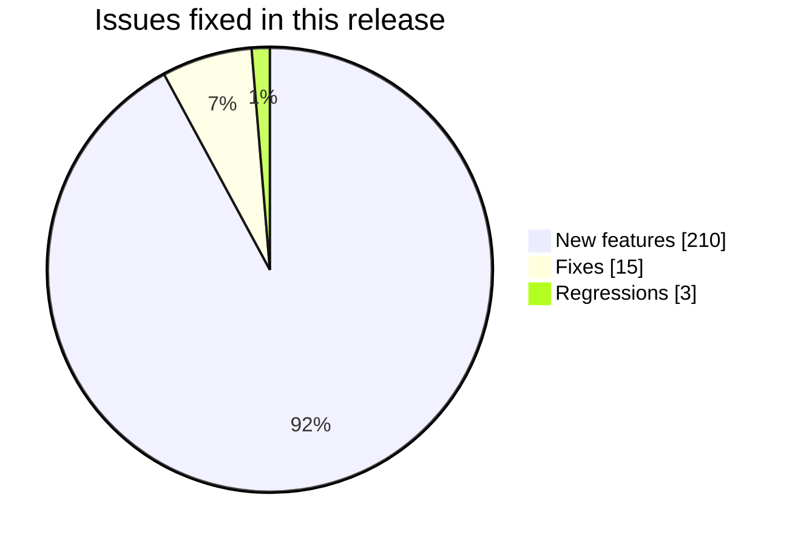
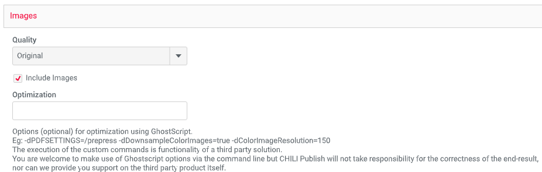
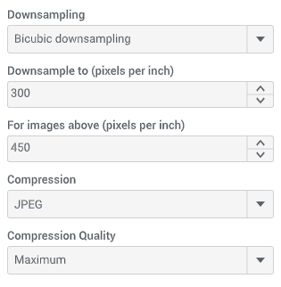
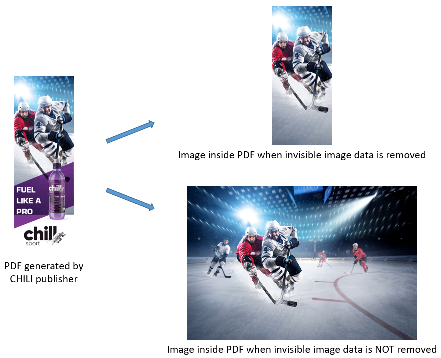
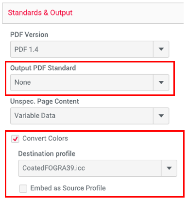
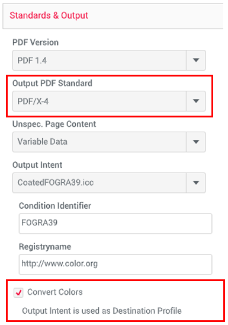
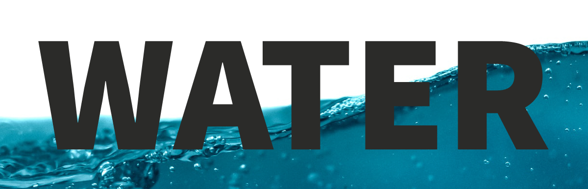
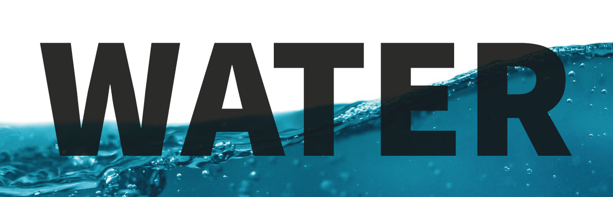
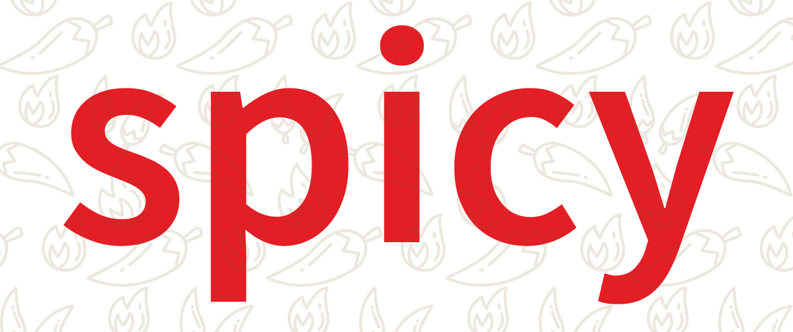

# GraFx publisher 2022

## New PDF optimization settings

An administrator can now choose from a range of PDF output settings to optimize how images are handled when output is generated. This allows you to create PDFs that are optimized to efficiently download, transfer, and process with your specific production workflows in mind.

Before version 2022, the only way to optimize your generated PDFs was to use one of the available quality settings, a custom Image Conversion Profile or Ghostscript optimization commands:

Now all of this has been replaced by some brand new settings that let you control the image downsampling, the image compression and whether you want to include the complete images or only the visible parts. You can also choose to convert the colors of all objects in the PDF to a specific destination profile.

This means that you cannot use an Image Conversion Profile for PDF output anymore. They are only used for image output from now on.

⚠️ Your existing PDF Export Settings will be mapped automatically to one of the new image quality presets. If you want to use a different preset or customize the settings to your needs, please go to your Backoffice and check out the new PDF Export Settings.

!!! note

	To see if you are ready, check out this article: [Are You Ready For Version 2022?](https://mysupport.chili-publish.com/hc/en-us/articles/4534667831452)

## Image downsampling and compression

You can choose one of the available image quality presets if you want to optimize your PDF for high quality output or for small file size or to keep your images in the original quality.

If this doesn't suit your needs, you can customize as you want. You can configure how the image downsampling and compression should work for different types of images: color, grayscale and monochrome.

## Remove invisible image data

You can crop out all the image data in the PDF that is invisible after the images are fitted into frames. This can significantly reduce the file size of the PDF without any visible difference.

## Convert colors

In the PDF Export Settings there is a new "Convert Colors" setting in the "Standards & Output" section (previously this section was called "Standards"). It enables you to convert the colors of all objects in the PDF to a destination color profile.

If you don't specify an Output PDF Standard, you have to choose a destination profile for color conversion.

If you do specify an Output PDF Standard, you also have to specify the Output Intent. In this case the Output Intent is used as destination profile for color conversion.

## Transparent PNG output

It is now possible to generate transparent PNG images! In the Image Conversion Profiles settings you can set the "Background Color" for PNG output to "Transparent" or to a specific RGB color, in case you want to replace the transparency by a color.

Please note that the "Padding Color" setting has been renamed to "Background Color," because it is used both for padding (if "Scaling" is set to "Exact") and as background color for the transparent parts of the PNG image (for all "Scaling" options).

⚠️ Up until now, if your Image Conversion Profile had "Padding Color" set to "Transparent", your PNG images were generated with a white background. If you don't change anything they will have a transparent background from now on. If you still want to have a white background, you have to set the "Background Color" to white instead of transparent.

⚠️ The "Transparent" option for "Padding Color" has been removed for JPEG output. Existing Image Conversion Profiles that use transparent padding for JPEG output will use white as padding color instead. If you want transparent padding you have to use PNG output, where you can set the "Background Color" to "Transparent".

!!! Note
	To see if you are ready, check out this article: Are You Ready For Version 2022?

## Overprint simulation

You can now generate images that simulate the effects of overprint in a PDF document, by enabling "Simulate Overprinting" in the Image Conversion Profiles. Overprint can be applied to text or to a frame border or fill, but PDF assets can also contain overprint. With this feature enabled you can have a more reliable validation workflow, since the generated image will show you how the PDF document with overprint will look like when it is printed.

Example 1: The "WATER" text is set to overprint to compensate for misregistration on a press. If you look closely at the bottom image, you can see that the black text is darker when printed on top of the water.

Without overprint simulation

With overprint simulation

Example 2: The "spicy" text is set to overprint to create an effect of the background items showing through the text, as you can see on the bottom image.

Without overprint simulation

With overprint simulation

## Changes to image output

With this version of CHILI publisher Online, we are using a new, state-of-the-art technology to generate images from PDFs. While this offers a lot of improvements and new features, as the ones mentioned above, it can also cause small differences in the image output, when compared to previous versions.

Besides that, one of the side effects of this new technology is that we had to replace the 1-100 numeric "Jpeg Quality" setting by 5 new options to define the image quality of the JPEG output: “Minimum," “Low," “Medium," “High” and “Maximum”.

Existing Image Conversion Profiles will be mapped automatically to one of the new options.

## Resolved issues
- Output: Fixed issue with some Asian fonts not being rendered correctly in image output
- Output: Fixed issue with rendering of transparent gradients in image output
- Output: Fixed issue with frame opacity not being applied in image output
- Output: Fixed issue with text rendering in PNG output with large dimensions when using a custom font and an image with a transparent background
- Editor: Fixed issue where a small border sometimes appeared in the editor around images with a white background

### 2022.0.1.0

Publishing date: 18 May 2022

- Editor: Added JPEG2000 compression option when editing PDF Export Settings in the editor (it was only available in the Backoffice)
- Output: Fixed failing PDF generation when applying image optimization or color conversion to a password protected PDF

### 2022.0.2.0

Publishing date: 2 June 2022

- Output: Fixed issue with color conversion not being applied during PDF generation
- Output: Fixed issue with color conversion of grayscale images in PDF output
- System: Added "ISO Coated v2 - GREY 1c - (basICColor)" to the list of available color profiles