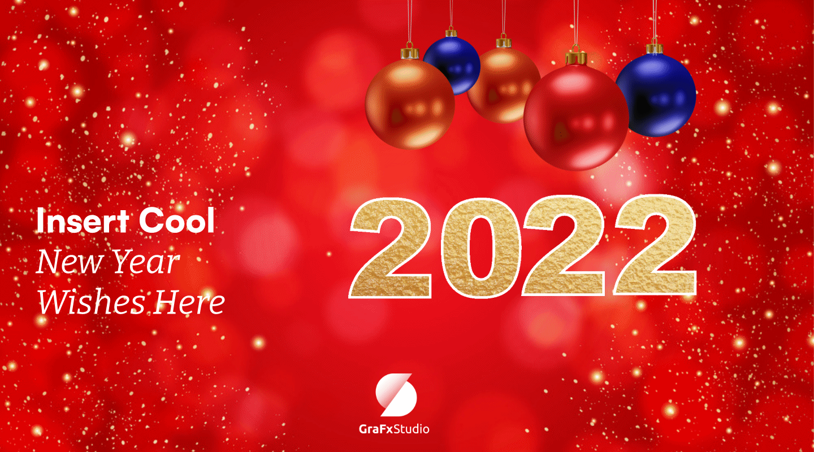
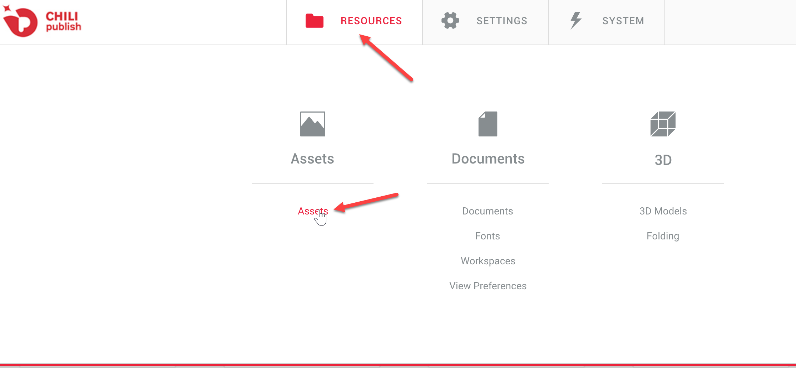
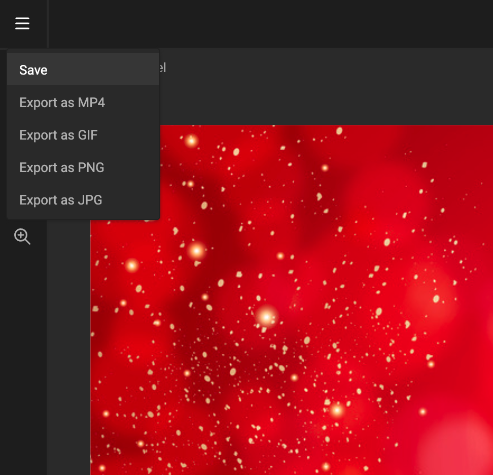
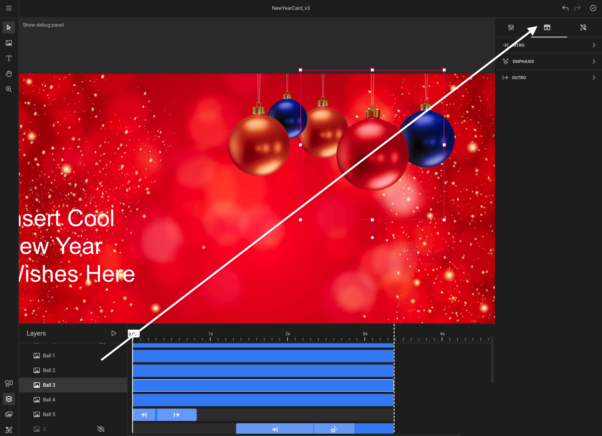
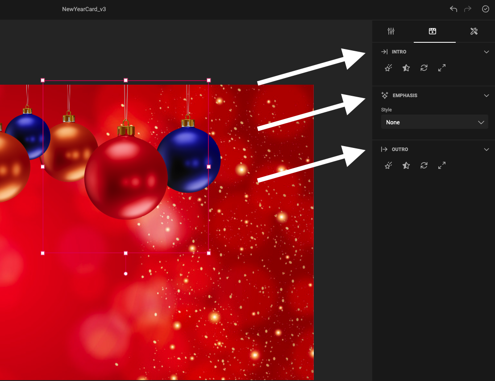
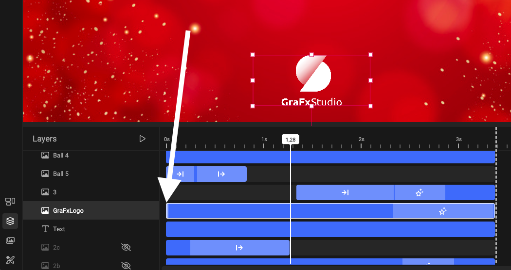
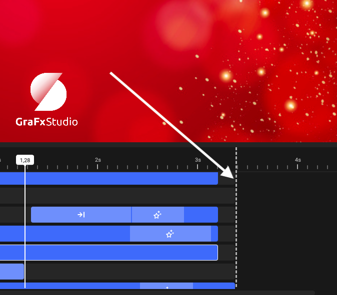
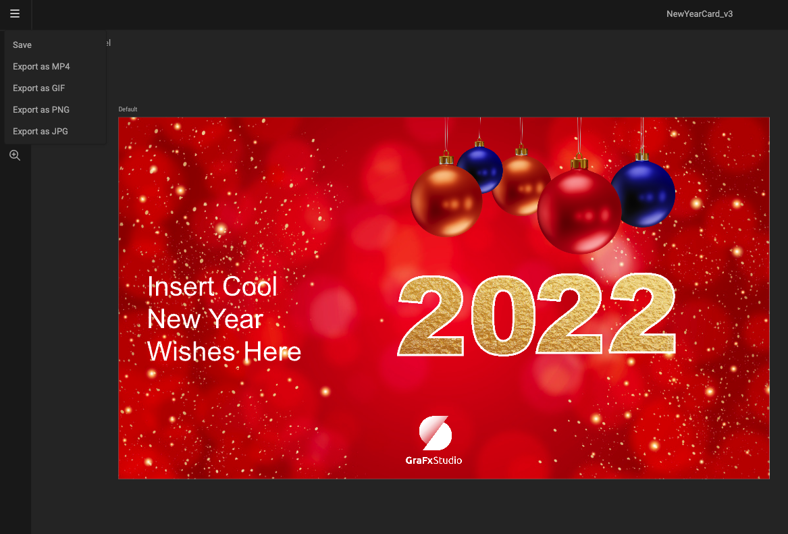

# Building A Holiday Card
📝 This guide was built using GraFx Studio

## Topics to discuss:
- Uploading assets
- Adding assets to a document
- Working with layers
- Animating with the timeline

## Intro
We are going to be building an animated holiday card that you can send to colleagues, friends, and family.

The end result can look like this:

 

 

# Steps
## Step 1: Uploading Assets
Login into GraFx at https://chiligrafx.com/ using your support account.

You will need to select a GraFx environment to be able to upload the assets.

You can find your environments by clicking on the environments button on the left toolbar.

 

 

### No Environments Shown?
If no environments are shown after clicking that button, please make sure you are on an active GraFx or Online subscription.

To do so:
1. First select the subscription dropdown
2. Then select a subscription that is active with the words Online or GraFx in it

 

 

## Choose Environment

Then choose an environment where you want to build you template.

 

 

Once an environment is chosen, the toolbar on the left will change to show the different applications on GraFx.

 

 

Now select:
1. Publisher icon in the toolbar
2. Open GraFx Publisher

 

 

### Logging In
You will need to log into the BackOffice using a BackOffice account.

Go to Resources -> Assets and create a new folder this probject.

 

 

In this guide we will create the folder "NewYearGuide"

 

 

Double click in that folder, and you upload the zip file with all the assets that you will need.

You can find the assets here:
LINK TO ZIP WITH ASSETS

Also, feel free to upload any files you think you might use to make your card unique.

This is also a good time to load any fonts that you may need, this can be done in the usueal way in the Back Office.

In the end, your folder should look like this:

 

 

## Step 2: Create A Studio Template
Alright, now that we have our assets uploaded lets close the BackOffice and go back to GraFx.
 
Select the Studio icon in the toolbar on the left.

 

 

This will bring up your Studio templates.

Now you may not have templates saved yet, but that is okay. We are going to create a new template anyway.

Select the "+ Create template" button to create a new template.

 

 

You can name the template whatever you want. Although, I suggest NewYearCard or some variation.

 

## Step 3: Place Media And Begin Your Design

Once you have created your new document you will want to resize from the default, to do this simply change the width and height on the right hand side. The NewYearCard is set to 1440px x 800px.

 

 

### Now time to start building your design.
First select the image frame icon in the quick tool location. 

 

 

Once you have your frame, select the Media icon via the bottom left quick tools. Here you can navigate to your assets you uploaded previously. By selecting the asset you require it will be placed in your selected image frame.

 

 

Repeat the above steps and place the assets you would like for your design.

## Step 4: Font and Text

Before placing any text you will need to load some fonts to your template, otherwise only the default one will be available.
Using the bottom quick tools once more select the bottom one Stylekit, then select fonts. Load your fonts by clicking the + icon and navigating to your fonts you uploaded previously.

 

 

Once you have fonts added to your Stylekit, its time to start adding some text.

This is done simply by selecting the text tool via the top left quick tool menu. Once you have some text in your frame the Text Style properties will be availiable via the right panel.
 

 

## Step 5: Your Design should be taking shape, now for Layers

Now that you have your design, this will be a good time to name your layers. By selecting the Layers icon via the bottom left quick icons you will be presented with a selection of timelines, one for each frame you placed, both text and image. It would be good practice to rename these layers for simple navigation later.

To do this, simply select the layer and click the three dots and select rename.

 

 

## Step 6: Don't forget to Save!
To Save your document, navigate to the burger menu at the top left and select Save.

 

 

## Step 7: Start To Animate

In our example, Baubles animated from the top and bounced on the text below. 

To start to animate your design, first select the frame you wish to animate and select the animation icon via the right hand properties panel.
The Bauble in the example uses an intro animation sliding in from the top, with an Ease Out set to Bounce.

More information regarding Animation can be found in the GraFx Studio Documentation:
https://docs.chiligrafx.com/GraFx_Studio/how_to/animate_frame/

 

 

You will also notice there are three animation types avaialiable, **Intro**, **Emphasis** and **Outro**. Each of these types has options such as **Fade In**, **Rotate** and **Expand**. In addition each of these options has it's own properties to define the animation.

 

 

## Step 8: Working with Layers and Timelines

Layers can be set to appear at different times. To modify your timeline, select the layer you which to edit and select the side of the timeline and slide to where you require.

When a timeline has an animation type set you will see this shown with the corosponding icon for each animation type (**Intro**, **Emphasis** or **Outro**). The animation can also be made longer or shorter using the same principle as above, by selecting the animation in the timeline and sliding along.

 

 

## Step 9: Adding more Animation

Multiple animation types can be applied to the same frame. In the Holiday Card example this was done to achieve additional effects with some time spent to achieve the correct timeing required.

Continue to build your animation until you have it just right.

 

## Step 10: Shortening the Timeline

The default timeline length for animation is 5 seconds, in the Holiday Card example this was shortened to just over 3 seconds.

To shorten the timeline this can be achieved by sliding the dashed line to the right of the timeline across. However, all layer timelines will need to be shortened first, otherwise the dashed line will not move.

 

 

## Step 11: Outputing your Design

Now that your document is complete and fully loaded with cool animation you will want to output. This is achieved via the burger menu where you saved your document. Choose an output type that suits your needs.

 

 
