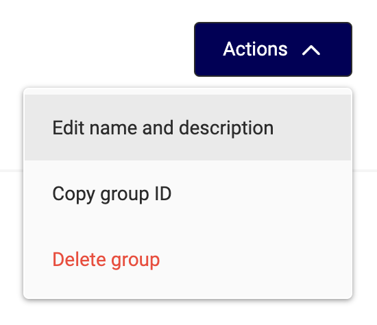

# Release notes

##  Mar 28, 2024 - GraFx Publisher

### Improvements

- Logging of PDF generation has been improved, giving you more insights.
- **DocumentProcessServerSide** endpoint output file is moved to a more sustainable location.  
!!! Info
	If you have hard-coded checks on the full path, you need to check your integration. The URL has changed.
	
	If you parse the result and use the download link provided, nothing needs to change.

##  Mar 28, 2024 - CHILI GraFx

### Features

- Federated User Groups: Enable users in a User Group of your Identity Provider to get instant access to CHILI GraFx.  
See [Federated Single Sign On](/CHILI-GraFx/concepts/federated-single-sign-on/) and [User Group Membership](/CHILI-GraFx/guides/manage-group-membership/#manage-membership-of-federated-users) for more details.

##  Mar 14, 2024 - GraFx Publisher

### New plugins

- for [Adobe® Illustrator®](/GraFx-Publisher/convert/Adobe-Illustrator/)
- for [Adobe® InDesign®](/GraFx-Publisher/convert/Adobe-InDesign/)

### Features

- Added support for Adobe® Illustrator®[^2] 2024 (28.x),
- Added support for Apple® silicon CPUs,
- Added a possibility to login with GraFx (SSO).

This version is compatible with Adobe® Illustrator® 2022 (26.x), 2023 (27.x) and 2024 (28.x).

This version is compatible with Adobe® InDesign® 2023 (18.x) and 2024 (19.x).

This version is compatible with GraFx Publisher and the on-premise version of CHILI Publisher (6.6.5.0).

!!! info

    Please uninstall the previous versions of the CHILI Plugins to avoid unexpected issues with the new releases.
    
    **Mac OS**
    
    Applications/CHILI publish/CHILI Desktop Tools/uninstall
    
    **Windows OS**
    
	Control Panel > Programs > Programs and Features > Uninstall or change a program >  
	**Look for CHILI Desktop Tools**
	
	C:\Program Files (x86)\CHILI publish\CHILI Desktop Tools\uninstall.exe

[^2]: Adobe® InDesign® and Illustrator® are either registered trademarks or trademarks of Adobe® in the United States and/or other countries. 

##  Mar 06, 2024 - CHILI GraFx

### Improvements

- PDF output endpoint has been moved from experimental to production
- Introduced endpoints to manage output settings
- Improved stability of connectors API

### Fixes

- Fixed error during parsing of MacOS fonts

### New Endpoints

Introduced output settings endpoints

- GET /api/v1/environment/{environment}/output/settings
- DELETE /api/v1/environment/{environment}/output/settings
- GET /api/v1/environment/{environment}/output/settings
- PUT /api/v1/environment/{environment}/output/settings/{outputSettingsId}
- POST /api/v1/environment/{environment}/output/settings/jpg
- POST /api/v1/environment/{environment}/output/settings/png
- POST /api/v1/environment/{environment}/output/settings/pdf
- POST /api/v1/environment/{environment}/output/settings/gif
- POST /api/v1/environment/{environment}/output/settings/mp4

Introduced PDF output task endpoint

- POST /api/v1/environment/{environment}/output/pdf

CHILI GraFx [Environment API 1.3.6](https://sandbox1.chili-publish-sandbox.online/grafx/swagger/index.html)

##  Mar 05, 2024 - GraFx Publisher

### Improvements

- Enhanced CHILI GraFx's handling of large VDP[^1] jobs.  
Media assets caching is improved, significantly reducing the overall processing time.

[^1]: VDP: Variable Data Processing, a.k.a. Variable Data Printing

- Improved performance  
Several technical improvements to the tech stack result in overall better performance.
- Improved preview of assets with blend mode in the GraFx Publisher Editor
- Switched output download link to a more sustainable location (URL remains to not break your integrations)

### Fixes

- Fixed issue when asset previews can’t be recreated after calling ResourceItemReplaceFile
- Fixed an issue where a (wrong) error was shown on the login page

##  Feb 27, 2024 - GraFx Studio

### Improvements

- Media search improvements in the Studio UI

### Fixes

- Fixed issue with color slider in the color picker
- Fixed issue with Folder setting for GraFx Media in image variable settings
- Fixed issue with image preview when image variable value is set by name

##  Feb 26, 2024 - CHILI GraFx

### Improvements

- The quality of the thumbnails for template & project in GraFx Studio have improved
- On the homepage the environments are now ranked with the most recent visited environment first
- On the user detail page it's indicated if a user is federated (= created in third party IDP of the client) or local (= created on CHILI GraFx)
- Restricted actions on federated users are now clarified by error messages
- You can now update the name and description of the created user groups.

### Features

- A default user group that contains all the users of a subscription is made available and can be used to easily assign all users to the same environment(s) with the same role(s)

### Security

- Security updates to the Platform API were made.

CHILI GraFx [Platform API](https://api.chiligrafx.com/swagger/index.html)
  
##  Feb 20, 2024 - GraFx Publisher

### Fixes

- Fixed cache issues when requesting Documents previews.  
Image preview download returns wront content type instead of image/png when async was set to false.
- Fixed issue where imageQuality property in PDF export settings isn't updated via Backoffice

### Improvements

- PDF generation performance has been improved when no post-processing options are selected in the PDF Export Settings. This is default for new PDF Export Settings.

##  Feb 20, 2024 - CHILI GraFx

### Improvements

- We added an `isGraFxPricebook` flag to subscription information in the API to reflect if a certain subscription belongs to a CHILI GraFx price book.

### Fixes

- Fixed an issue where data was shown incorrectly when user roles were updated in the individual access tab of the user

CHILI GraFx [Platform API](https://api.chiligrafx.com/swagger/index.html)

##  Feb 16, 2024 - GraFx Studio

### Features

- Added support for CMYK colors
- Added letter spacing (tracking) to the text style properties
- You can select multiple frames by holding the Shift key and move and resize them together
- In an action, you can use the name of an asset to easily change an image variable based on user input (previously, you could only use the asset ID)

### Improvements

- The height of the animation timeline panel can be changed
- The color picker and text style panels can be moved
- Added a search field when browsing for images in the Studio UI
- Next to specifying a folder for image variables, you can now also specify if subfolders are included or not
- Improved rendering performance of text frames
- Improvements to PDF output (experimental)

### Fixes

- Fixed compatibility with some browser extensions (e.g. ZoomInfo)
- Fixed size of text cursor for low copyfitting values
- Fixed issue with updating text variables when they are placed at the end of a text frame

##  Feb 1, 2024 - GraFx Media

### Improvements

- In GraFx Media you can move an asset from one place within the environment to another using the quick actions menu.

##  Feb 1, 2024 - CHILI GraFx

??? note "Change in URLs"

 We've updated the way how our URLs in the platform are built.
    This means that if you have bookmarks (especially if they are linking to a certain environment) that the URLs will bring you to a 404.
    This change was necessary to have a more consistent way of navigating the platform.
    Please update your bookmarks to follow the new structure.

### Features

- Introducing User Groups to invite users in bulk to environments with a specific role per environment
- A user can be added to a user group when they are invited to CHILI GraFx for the first time or from the User Management page on CHILI GraFx
- User Group membership, User Group details (name & description) and assignement of environment and roles are managed by the Subscription Admin

[Documentation on user groups](/CHILI-GraFx/guides/manage-user-groups/)

### API updates

We're aiming to keep things smooth with a CI/CD approach; automatically rolling out updates to make sure you get the best experience. We'll give you a heads-up in the release notes only when there's something new and cool that changes how you use the platform.

### Improvements Platform API

- Possibility to configure allowed federated domains for external users
- Introduced "isFederated" field in the user model to reflect the federation status

CHILI GraFx [Platform API](https://api.chiligrafx.com/swagger/index.html)

### Improvements Environment API

- New naming for default output settings
- Several minor updates and fixes

CHILI GraFx [Environment API 1.3.5](/GraFx-Developers/#environment-api)

##  Jan 30, 2024 - GraFx Publisher

### Fixes

- Improved stability for larger VDP sizes
- Task status is set to ‘false’ when no output was produced

##  Jan 26, 2024 - CHILI GraFx

### Fixes

- Fixed an error where you could not access the platform

##  Jan 25, 2024 - CHILI GraFx

CHILI GraFx [Environment API 1.3.4](/GraFx-Developers/#environment-api)

### Improvements

- Introduce png variable output endpoint  
api/v1/environment/{environmentId}/output/png
- Introduce gif variable output endpoint  
api/v1/environment/{environmentId}/output/gif
- Introduce jpg variable output endpoint  
api/v1/environment/{environmentId}/output/jpg
- Introduce 'default' output settings
- Add 'scaling' option to output settings
- Sort font styles by weight

### Fixes

- Update authorization rules for Content Administrator role
- Fix video output issues
- Avoid potential resources duplicates
- Ignore font style 'width' property on upload

### Experimental

- Introduce oauth-authorization-code endpoints  
(api/experimental/environment/{environment}/connectors/{connectorId}/auth/oauth-authorization-code)
- Introduce 'none' auth for connector definition

##  Jan 24, 2024 - GraFx Publisher

### Fixes

- When outputting a PDF with a variable in the path name, the value of the variable is now used correctly.
- Fixed the issue where an asset could end up as duplicate using ResourceItemAdd, when a path was malformed.
- Fixed vulnerability where code details were shown in an error message
- Fixed incorrect behavior for the ResourceSearchInFolder API endpoint related to the parentFolderPath parameter. Previously, when includeSubDirectories was set to true, the endpoint performed a prefix search. This behavior has been corrected to conduct an exact search, aligning with expectations set in prior versions of CHILI.
- Fixed issue where some characters in REST endpoint query parameters cause the endpoint to fail

### Improvements

- A download will now be served from a more sustainable location
- Improved performance when copying a file with an existing name

##  Jan 19, 2024 - CHILI GraFx

### Improvements

- Deprecated endpoints were deleted from the API  

### Fixes

- Render visualization showed wrong metrics

CHILI GraFx [Platform API](https://api.chiligrafx.com/swagger/index.html)

##  Jan 16, 2024 - GraFx Publisher

### Fixes

- Fixed issues where specific PDF assets caused corruption in the PDF output file

##  Jan 9, 2024 - CHILI GraFx

### Improvements

- User groups  
User groups allow admins to set permissions and access to user groups next to individual users. This release integrates user group permissions into our authorization process, available through the API.

### Fixes

- Monthly renders of the last range weren't returned

CHILI GraFx [Platform API](https://api.chiligrafx.com/swagger/index.html)

##  Jan 4, 2024 - GraFx Studio

### Features

- You can now cut (Ctrl/Cmd+X), copy (Ctrl/Cmd+C), paste (Ctrl/Cmd+V), and duplicate (Ctrl/Cmd+D) frames in the Template Designer workspace. This is possible with the shortcuts or via the quick actions in the Layers panel

### Improvements

- Added more tooltips to the Template Designer workspace and made some improvements to them
- Assigning an image to an image variable is now possible via a single click
- Changed the min and max values for copyfitting to 1% and 10.000% (it was 10% and 1.000%)
- Moved the "Clear style overrides" button to another location in the Template Designer workspace

### Fixes

- Fixed issue with low quality image previews in the Studio UI
- Fixed issue with variable text not being updated after undo/redo
- Fixed issue with the number of triggers not being shown in red when hovered while in error state
- Fixed issue with the media connector sending multiple download requests
- Fixed issue with actions throwing the same error twice
- Fixed issue where a font that is used in the template could be deleted without getting a confirmation dialog

##  Jan 2, 2024 - GraFx Publisher

### Fixes

- Fixed issue where datasource output with one record does not respect the PDF Name Pattern
- Fixed issue when deletion of a resource may cause deletion of other resources with similar name
- Improved error messaging when output generation fails

## 2023

See [this page](/release-notes/2023/) for 2023 release notes.
