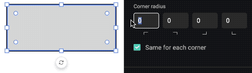

# GraFx Studio

Version 0.123.1, using Studio SDK [0.123.0](https://github.com/chili-publish/studio-sdk/releases){target="_blank"}

## Features

- You can change the corner radius of your rectangle and polygon shapes by dragging the round handles in the shape or by using the corner radius properties in the frame properties panel

## Improvements

- When a new frame is added it is only visible on the selected layout and its sub-layouts, on all other layouts the frame is hidden (if you want a frame to be visible on all layouts you should add it on the top-level layout)