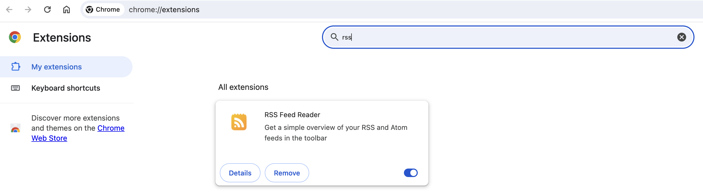
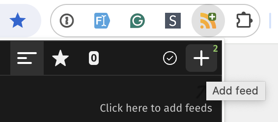
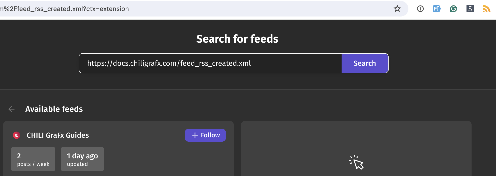
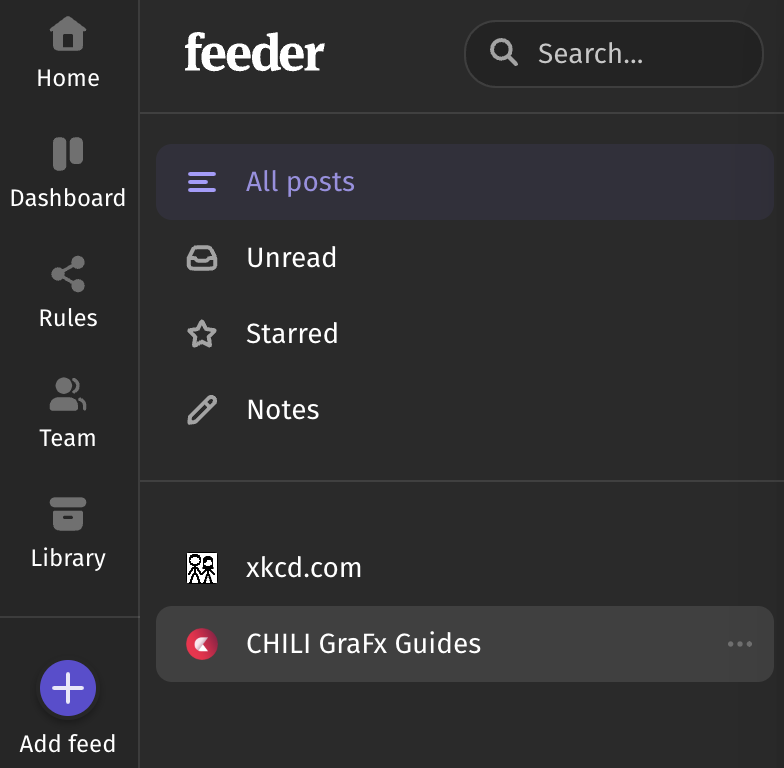
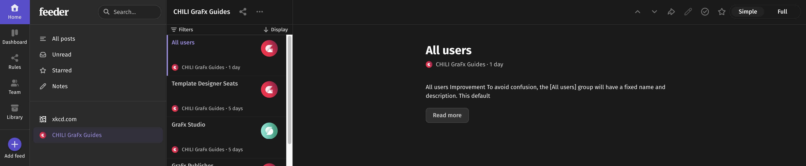
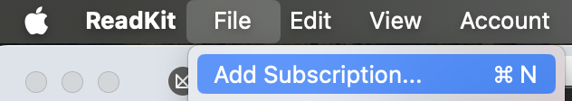
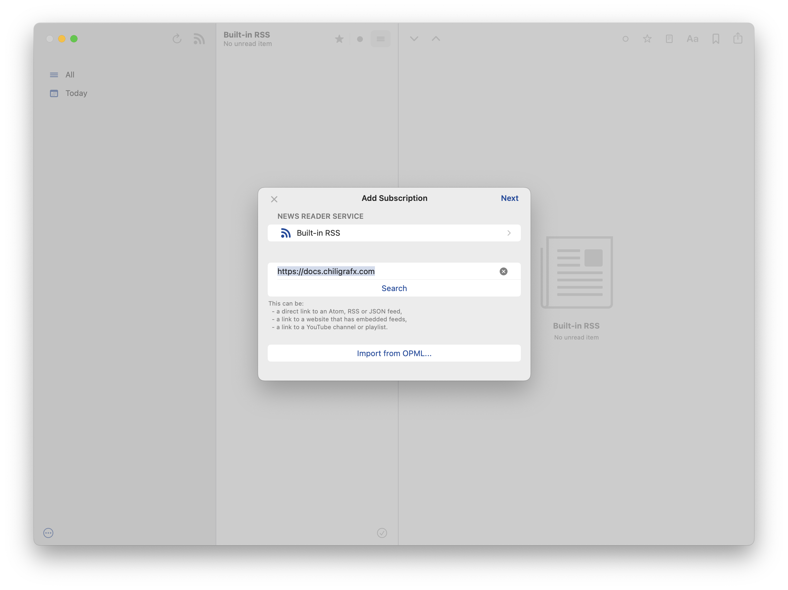
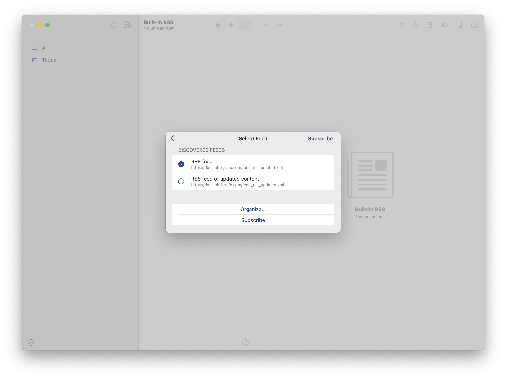
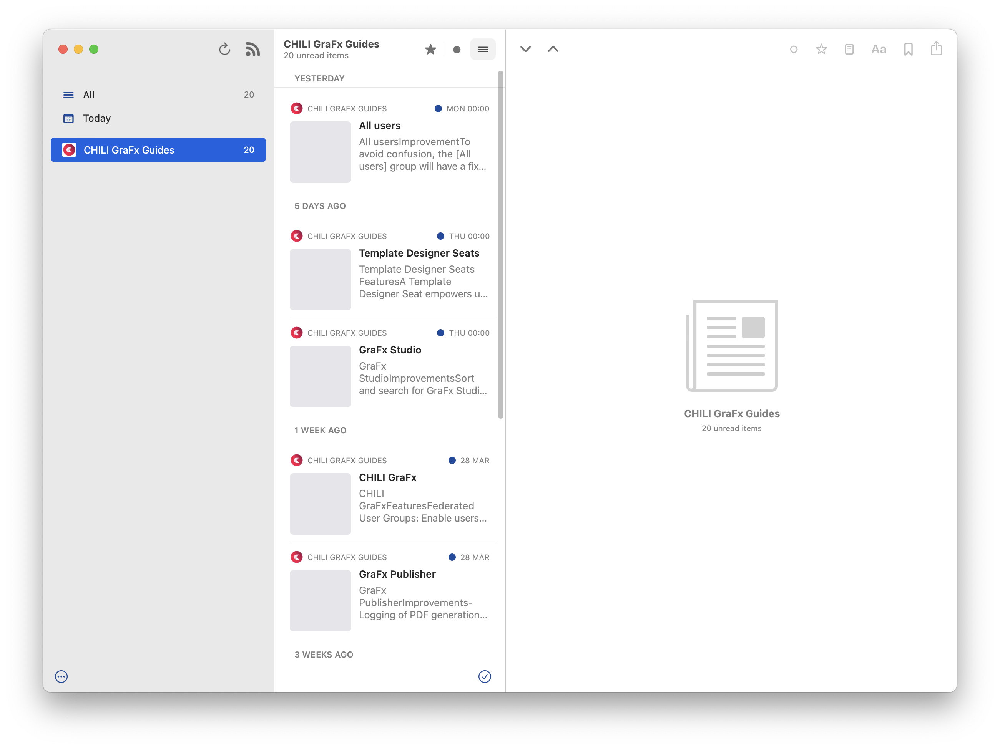
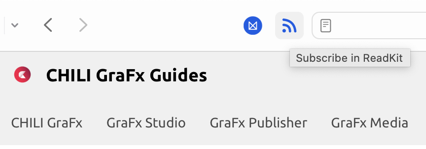

# CHILI GraFx release notes as RSS feed

## TL;DR

[TL;DR](https://en.wikipedia.org/wiki/TL;DR)?

If you know how RSS works, here is the URL!

``` js
https://docs.chiligrafx.com/feed_rss_created.xml
```

## Intro

An RSS feed is a type of web feed that allows users to access updates to online content in a standardized, computer-readable format. 
This enables you to receive timely updates from your favorite websites — in this case, our Release Notes — without having to visit each site individually.

## Subscribe through your browser plugin

I you have not installed an RSS extension, go to [Extensions (Chrome)](chrome://extensions/) and find "RSS". Install the extension.



There are plenty of RSS extensions for your browsers. Below is one example for [Feeder](https://feeder.co/), others work similarly.

### Feeder in Chrome


Click the RSS icon, and click the "+" button. 



If the extension does not recognize the feed, you can enter it manually.

``` HTML
https://docs.chiligrafx.com/feed_rss_created.xml
```



Click "Follow"



Your feed is now available.




## Using an RSS Application

There are many RSS applications, that work similarly to a browser.

This example shows "[Readkit](https://apps.apple.com/us/app/readkit-read-later-rss/id1615798039)" for OSX.

In the application, add a subscription.



Add the URL

``` HTML
https://docs.chiligrafx.com/
```

No need to add the XML file, it will search for it automatically.



Select the feed you want to subscribe. The "Feed" is the main thread of all releases. The "feed of updated content" will give you the feed for articles that have been updated.



Hit subscribe, and you are ready to follow.



Readkit has an integration with Safari, and you can subscribe directly from your Safari Browser.



## Conclusion

By subscribing to the RSS feed through either method, you can stay updated with the latest additions and changes to the CHILI GraFx platform.