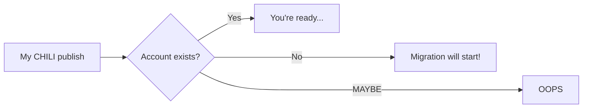

# Testing out MarkDown syntax

``` mermaid
graph LR
  A[My CHILI publish] --> B{Account exists?};
  B -->|Yes| C[You're ready...];
  B ---->|MAYBE| D[OOPS];
  B --->|No| E[Migration will start!];
```

